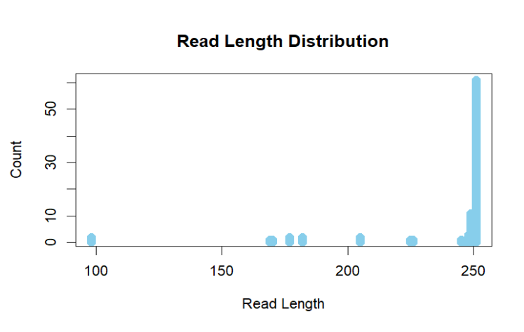

#### Extract the reads that mapped to the ID'ed taxa in Reynoso-García et al.
```
grep 'Zea\|Ipomoea\|Capsicum\|Arachis\|Carica\|Solanum\|Gossypium\|Nicotiana' SRR24300527.names.out >> targets.out
grep 'Zea\|Ipomoea\|Capsicum\|Arachis\|Carica\|Solanum\|Gossypium\|Nicotiana' SRR24300528.names.out >> targets.out
cut -f 2 targets.out > target_reads.txt

seqtk subseq metawrap_output/SRR24300527/final_pure_reads_1.fastq target_reads.txt >> target_seqs.fastq
seqtk subseq metawrap_output/SRR24300527/final_pure_reads_2.fastq target_reads.txt >> target_seqs.fastq
seqtk subseq metawrap_output/SRR24300528/final_pure_reads_1.fastq target_reads.txt >> target_seqs.fastq
seqtk subseq metawrap_output/SRR24300528/final_pure_reads_2.fastq target_reads.txt >> target_seqs.fastq
```

#### Read length distribution 
```
bioawk -c fastx '{print length($seq)}' *.fastq | sort -n | uniq -c > target_read_length_dist.txt

#IN R:
# Read the output from the command into R
output <- read.table("target_read_length_dist.txt", header=FALSE)

# Set the column names
colnames(output) <- c("Count", "Read_Length")

# Convert Read_Length to numeric
output$Read_Length <- as.numeric(as.character(output$Read_Length))

# Plot the distribution
plot(output$Read_Length, output$Count, type="h", lwd=10, col="skyblue", xlab="Read Length", ylab="Count", main="Read Length Distribution")
```



# Lastly we BLASTed the reads assigned to any of the reported species by Kaiju. The results can be found (here)[]
